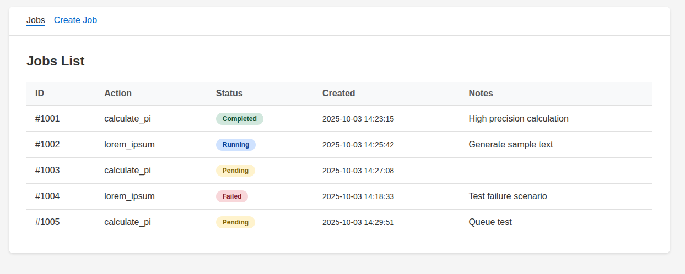
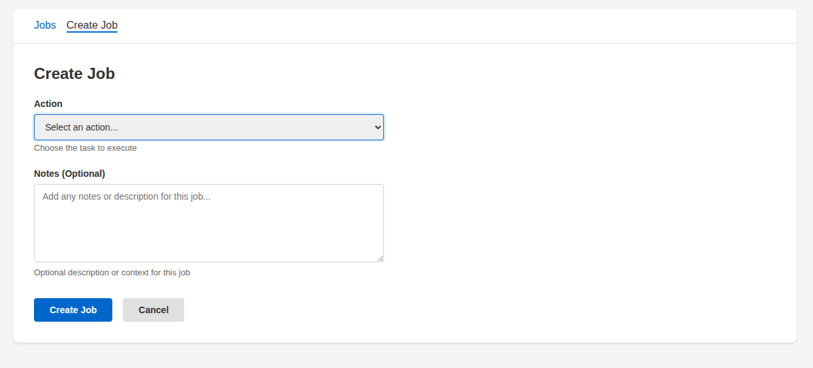

# Frontend Requirements (React)

## Setup Instructions

1. Install Node.js 18+ and npm
2. Run `npm install` to install dependencies
3. Run `npm run dev` to start the development server
4. Application will be available at http://localhost:3000

## Pages/Views

1. List Jobs (display job ID, task type, status, created timestamp and notes)
2. Create Job (specify job action & optional user notes)
   - Supported actions are `calculate_pi` and `lorem_ipsum` (see `/runner/README.md`)

## Requirements

- Use React hooks (useState, useEffect)
- Implement routing (React Router or similar)
- Handle loading and error states
- Form validation (required fields, allowed job actions)
- Make API requests to relative `/api/...` paths; the Vite dev server proxies them to the backend at `http://localhost:8080` (see `vite.config.js`)

## Must Have (Core Requirements)

- ✅ List & create Jobs
- ✅ Show current status of jobs
- ✅ Basic error handling and validation
- ✅ Loading states during API calls
- ✅ Code is clean, organized, and readable

## Nice to Have (Quality Indicators)

- Abstract out API client logic
- Better error messages and user feedback
- UX polish (animations, transitions)
- Clean separation of concerns
- Responsive design
- Code comments where helpful
- Remove inline styles and use CSS
- Accessibility

# Bonus Goals

## Job Canceling/Control
If implementing runner remote job canceling/control, add a control button to the jobs list UI to cancel a job.

## Pagination
Paginate the list of jobs (20 per page).

## Be Creative!
Feel free to add other improvements. Make sure to mention them in your README.

# Inspiration
If you are looking for inspiration or an example for your page layout, you can use the examples below. You can always make your own design as long as it solves the goals — **we prioritize quality and attention to details of implementation over exactly matching the example design**.

The styling values for the examples are in the `styles.txt` file.

